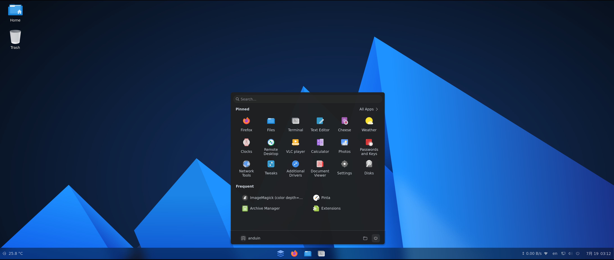

# AnduinOS

AnduinOS is a custom Debian-based Linux distribution that aims to facilitate developers transitioning from Windows to Ubuntu by maintaining familiar operational habits and workflows.

AnduinOS is built on the Ubuntu Noble package base.

[Download AnduinOS](https://www.anduinos.com/)

## Document

[Read the document](https://docs.anduinos.com/)

## License

This project is licensed under the GNU GENERAL PUBLIC LICENSE - see the [LICENSE](LICENSE) file for details

The open-source software included in AnduinOS is distributed in the hope that it will be useful, but WITHOUT ANY WARRANTY.

[List of open-source software included in AnduinOS](OSS.md)

## Support

For community support and discussion, please join our [AnduinOS Discussions](https://github.com/Anduin2017/AnduinOS/discussions).

For bug reports and feature requests, please use the [Issues](https://github.com/Anduin2017/AnduinOS/issues) page.

<!-- TODO
www.anduinos.com       # Homepage
docs.anduinos.com      # MkDocs
downloads.anduinos.com # ISO Download
 -->