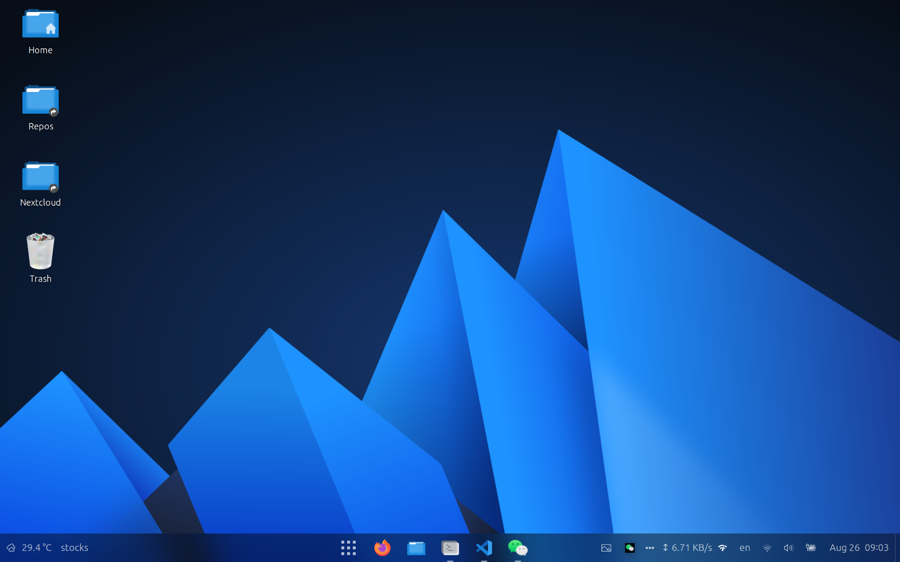

# AnduinOS

AnduinOS 是一个 Ubuntu 自定义设置、应用、主题的整合包。旨在方便用户从 Windows 迁移到 Linux 时可以看到熟悉的操作习惯和应用。



AnduinOS 是在 Ubuntu 的基础上额外提供了一些扩展，包括：

* 提供了中文输入法
* 提供了一个类似 Windows 11 的UI
* 提供了一些常用软件
* 删除了 snap

AnduinOS 测试了这些软件和UI的整合体验，因此在使用时一般不会遇到奇怪的问题。

> 注意： AnduinOS 会引用闭源软件！

> 注意： AnduinOS 会修改系统设置，尤其是 apt 的设置！

## 部署 AnduinOS

显然，AnduinOS 并不是独立的操作系统。因此必须先安装 Ubuntu 。

在这里下载 Ubuntu ： [Ubuntu Desktop Download](https://ubuntu.com/download/desktop)

安装用户喜欢的方式部署 Ubuntu 即可。不需要特别的设置。

在第一次登录 Ubuntu 后，打开终端（Ctrl + Alt + T），然后运行：

```bash
bash -c "$(wget -O- https://gitlab.aiursoft.cn/anduin/anduinos/-/raw/master/install.sh)"
```

即可完成 AnduinOS 的部署。

当然，在部署完成后，你可以继续像使用 Ubuntu 那样为它安装软件。

## AnduinOS 做了什么

AnduinOS 通过额外安装了大量第三方软件来提供体验。

AnduinOS 会安装下列软件：

* Firefox 作为主浏览器
* Google Chrome 作为备用浏览器
* Rime 作为输入法
* Nextcloud 作为云盘
* Visual Studio Code 作为主要代码编辑器
* Remmina 作为远程桌面
* Spotify 作为音乐播放器
* Pinta 作为图片编辑器
* VLC 作为视频播放器
* WPS Office 作为办公软件
* OBS Studio 作为录屏软件
* Docker Desktop 作为容器软件
* WeChat 作为聊天软件
* Blender 作为3D建模软件
* Motrix 作为下载工具
* Google Earth 作为地图软件
* Shotcut 作为视频编辑器
* DbBrowser 作为数据库管理工具

这些软件几乎涵盖了日常使用的所有场景。

AnduinOS 使用 ibus 作为输入法的后端，使用 Rime 作为输入法的前端。运行的默认输入法配置来自 [雾凇拼音](https://github.com/iDvel/rime-ice)。

AnduinOS 会配置下列开发环境：

* NodeJS, NPM & Yarn
* Golang
* .NET
* Java
* Ruby
* Python
* Docker
* Docker Compose
* Hugo

AnduinOS 会安装下列 CLI 工具：

* Vim
* Git
* Neofetch
* Wget
* Curl
* Aria2
* Iperf3
* FFmpeg
* Tree
* Htop
* W3m

AnduinOS 使用了一些第三方主题来修改桌面体验，包括但不限于：

* [Fluent-gtk-theme](https://github.com/vinceliuice/Fluent-gtk-theme)
* [Fluent-icon-theme](https://github.com/vinceliuice/Fluent-icon-theme)

AnduinOS 使用了一些 Gnome 插件：

* ArcMenu 用于提供类似 Windows 11 的开始菜单
* Blur My Shell 用于提供类似 Windows 11 的模糊效果
* Dash to Panel 用于提供类似 Windows 11 的任务栏
* Network Stats 用于提供网络状态查看
* OpenWeather 用于提供任务栏左下角的天气查看
* Removable Drive Menu 用于提供任务栏右下角的设备查看
* Stocks Menu 用于提供任务栏左下角的股票查看
* User Themes 用于提供主题切换
* BackSlide 用于提供壁纸切换

AnduinOS 使用的默认壁纸是来自于 [Fluent-gtk-theme](https://github.com/vinceliuice/Fluent-gtk-theme/tree/Wallpaper) 的壁纸。
