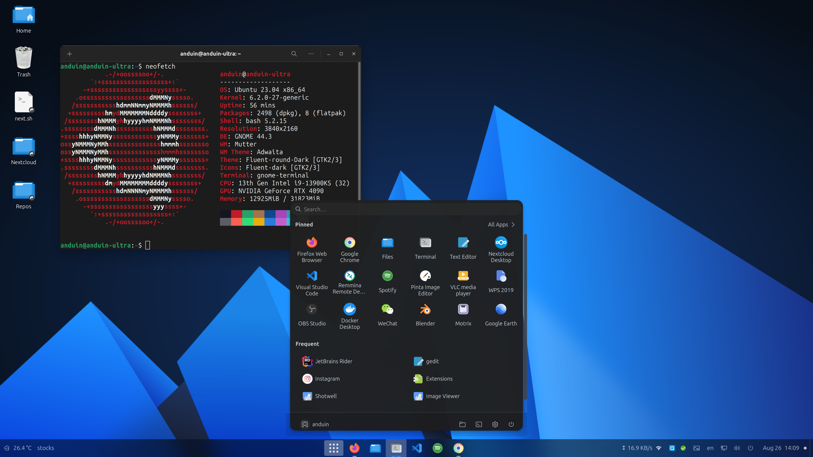

# AnduinOS

AnduinOS 是一个 Ubuntu 自定义设置、应用、主题的整合包。旨在方便用户从 Windows 迁移到 Linux 时可以继续熟悉的操作习惯和工作。



AnduinOS 是在 Ubuntu 的基础上额外提供了一些扩展，包括：

* 提供了中文输入法
* 提供了一个类似 Windows 11 的UI
* 提供了一些常用软件
* 删除了 snap

AnduinOS 测试了这些软件和UI的整合体验，因此在使用时一般不会遇到奇怪的问题。

> 注意： AnduinOS 会引用闭源软件！

> 注意： AnduinOS 会修改系统设置，尤其是 apt 的设置！

## 部署 AnduinOS

显然，AnduinOS 并不是独立的操作系统。因此必须先安装 Ubuntu 。

在这里下载 Ubuntu 23.04： [Ubuntu Desktop Download](https://ubuntu.com/download/desktop)

按照用户喜欢的方式部署 Ubuntu 即可。不需要特别的设置。

在第一次登录 Ubuntu 后，打开终端（Ctrl + Alt + T），然后运行：

```bash
bash -c "$(wget -O- https://gitlab.aiursoft.cn/anduin/anduinos/-/raw/master/install.sh)"
```

即可完成 AnduinOS 的部署。

当然，在部署完成后，你可以继续像使用 Ubuntu 那样为它安装软件。

> 注意：我们只测试了 Ubuntu 23.04 中的部署效果并且没有任何包冲突。22.04 可能会遇到包版本冲突。其他 Linux 发行版不保证可以运行。

## AnduinOS 做了什么

AnduinOS 会允许当前用户免密码使用 sudo。

> 这会带来一些安全风险，但是这是为了方便用户使用。如果不喜欢这个设定，可以在运行完成后删除 /etc/sudoers.d/$USER 文件。

AnduinOS 通过额外安装了大量第三方软件来提供体验。

AnduinOS 会安装下列软件：

* Firefox 作为主浏览器
* Google Chrome 作为备用浏览器
* Rime 作为输入法
* Nextcloud 作为云盘
* Visual Studio Code 作为主要代码编辑器
* Shotwell 作为图片管理器
* Gnome weather 作为天气软件
* Cheese 作为摄像头软件
* Gnome Clocks 作为时钟软件
* Remmina 作为远程桌面
* Spotify 作为音乐播放器
* Pinta 作为图片编辑器
* VLC 作为视频播放器
* WPS Office 作为办公软件
* OBS Studio 作为录屏软件
* Docker Desktop 作为容器软件
* WeChat 作为聊天软件
* Blender 作为3D建模软件
* Motrix 作为下载工具
* Google Earth 作为地图软件
* Shotcut 作为视频编辑器
* Insomnia 作为API测试工具
* DbBrowser 作为数据库管理工具
* Gnome Boxes 作为虚拟机管理工具

这些软件几乎涵盖了日常使用的所有场景。

AnduinOS 使用 ibus 作为输入法的后端，使用 Rime 作为输入法的前端。运行的默认输入法配置来自 [雾凇拼音](https://github.com/iDvel/rime-ice)。

AnduinOS 会配置下列开发环境：

* NodeJS, NPM & Yarn
* Golang
* .NET 6 & 7 (And Entity Framework)
* Java (OpenJDK)
* Ruby
* Python
* Docker
* Docker Compose
* Hugo

AnduinOS 会安装下列 CLI 工具：

* Vim
* Git
* Neofetch
* Wget
* Curl
* Aria2
* FFmpeg
* Tree
* Htop
* W3m

AnduinOS 会安装一些pip全局工具：

* Youtube-dl
* Gnome-extensions-cli

AnduinOS 会安装一些.NET全局工具：

* EntityFrameworkCore
* Aiursoft.Static

AnduinOS 使用了一些第三方主题来修改桌面体验，包括但不限于：

* [Fluent-gtk-theme](https://github.com/vinceliuice/Fluent-gtk-theme)
* [Fluent-icon-theme](https://github.com/vinceliuice/Fluent-icon-theme)

AnduinOS 使用了一些 Gnome 插件（并会自动初始化这些插件）：

* ArcMenu 用于提供类似 Windows 11 的开始菜单
* Blur My Shell 用于提供类似 Windows 11 的模糊效果
* Dash to Panel 用于提供类似 Windows 11 的任务栏
* Network Stats 用于提供网络状态查看
* OpenWeather 用于提供任务栏左下角的天气查看
* Removable Drive Menu 用于提供任务栏右下角的设备查看
* Stocks Menu 用于提供任务栏左下角的股票查看
* User Themes 用于提供主题切换
* BackSlide 用于提供壁纸切换

AnduinOS 使用的默认壁纸是来自于 [Fluent-gtk-theme](https://github.com/vinceliuice/Fluent-gtk-theme/tree/Wallpaper) 的壁纸。

## 已知的问题

* 微信的体验并不是很良好，包括无法从剪贴板粘贴图片、无法截图、无法使用系统通知等。
* VSCode 在 Wayland 下，如果开启了 Fractional Scaling，可能会出现字体模糊的问题。
* Chrome 在 Wayland 下，如果开启了 Fractional Scaling，可能会出现无法输入中文的问题。

对于 Chromium 相关的问题：

* 可以选择使用 X11 来代替 Wayland。
* 可以选择使用 Firefox 来代替 Chrome。
* 为了缓解字体模糊问题，可以在启动这些 Chromium 应用时增加参数：`--enable-features=UseOzonePlatform --ozone-platform=wayland`。
* 为了缓解中文输入问题，可以在启动这些 Chromium 应用时增加环境变量：`GTK_IM_MODULE=ibus`，并增加参数：`google-chrome  --gtk-version=4`。

如果遇到微信显示太小：

* 可以修改 Wine 的设置调整微信的 DPI：`env WINEPREFIX=~/.deepinwine/Deepin-WeChat deepin-wine6-stable winecfg`，在Graphics设置中，将 DPI 调整到一个更高的值，例如 192。可能需要重启来生效。

## 为什么选择 Ubuntu 作为魔改的来源

Ubuntu 对于 Linux 初学者来说非常流行，它有着还算不错的生态，并且默认就很好看。这使得它成为了最好的魔改来源。

无论是专业的开发人员，或是普通的用户，适应 Ubuntu 都不算太难。

## 其他推荐的软件

这些软件 AnduinOS 并不会预装。但是它们不会来带引用冲突，并且体验已经测试过非常好。

如果有需要可以安装：

* Stellarium
* Steam
* Dropbox (已经测试可以完全替代 Nextcloud)
* Kdenlive (已经测试可以完全替代 Shotcut)
* Telegram (已经测试可以完全替代 WeChat)
* FreeDownloadManager (已经测试可以完全替代 Motrix)
* Postman (已经测试可以完全替代 Insomnia)
* DaVinci Resolve (已经测试可以完全替代 Shotcut)
* GIMP (已经测试可以完全替代 Pinta)
