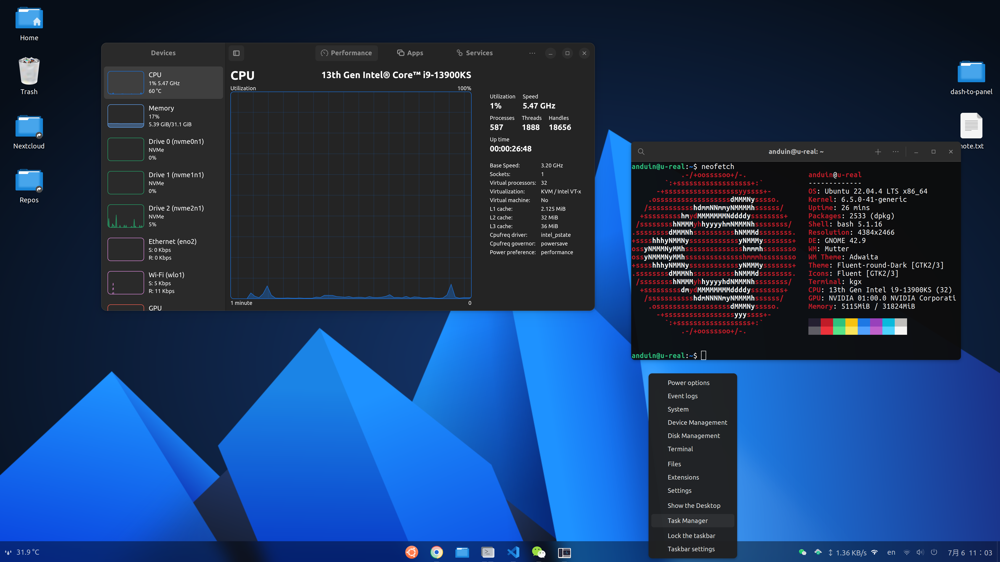

# AnduinOS

[](https://gitlab.aiursoft.cn/anduin/AnduinOS/-/commits/master?ref_type=heads)

[中文文档](./README.ZH.md)

AnduinOS is a comprehensive package integrating custom settings, applications, and themes into Ubuntu. It aims to help users transition from Windows to Linux while retaining familiar operational habits and workflows.


AnduinOS enhances Ubuntu by providing additional features, including:

* Chinese input methods
* A UI similar to Windows 11
* Various commonly used software
* Removal of snap

AnduinOS has been tested to ensure a seamless integration of these software and UI elements, minimizing the likelihood of encountering unusual issues during use.

> Note: AnduinOS includes proprietary software!

> Note: AnduinOS modifies system settings, particularly apt configurations!

## Deploying AnduinOS

Clearly, AnduinOS is not an independent operating system. Therefore, Ubuntu must be installed first. **English** versions of Ubuntu 22.04 must be installed.

Download Ubuntu 22.04 here: [Ubuntu Desktop Download](https://releases.ubuntu.com/22.04.4/ubuntu-22.04.4-desktop-amd64.iso)

Install Ubuntu in any preferred manner. No special settings are required. It works with both Desktop and Server versions, on virtual machines, physical machines, or containers.

After logging into Ubuntu for the first time, open the terminal (Ctrl + Alt + T) and run:

```bash
bash -c "$(wget -O- https://gitlab.aiursoft.cn/anduin/anduinos/-/raw/master/install.sh)"
```

This will complete the deployment of AnduinOS.

Of course, after deployment, you can continue to install software as you would with Ubuntu.

> Note: We have only tested AnduinOS deployment on Ubuntu 22.04 with no package conflicts. Other versions may encounter package version conflicts!

Click [here](https://releases.ubuntu.com/22.04.4/ubuntu-22.04.4-desktop-amd64.iso) to download Ubuntu 22.04.

## What AnduinOS Does

AnduinOS allows the current user to use sudo without a password.

> This poses some security risks, but it is for user convenience. If you do not like this setting, you can delete the /etc/sudoers.d/$USER file after running.

AnduinOS enhances the experience by installing a multitude of third-party software. Anduin OS will automatically select the fastest software source based on latency.

AnduinOS installs the following GUI software:

* Seahorse as a key management tool
* Baobab as a disk analysis tool
* Nautilus as a file manager
* Evince as a PDF reader
* Cheese as a webcam tool
* Firefox as the main browser
* Google Chrome as an alternative browser
* IBus Rime as an input method
* Nextcloud as a cloud drive
* Visual Studio Code as the main code editor
* Gnome Text Editor as an alternative code editor
* Gnome-calculator as a calculator
* File Roller as an archive manager
* Shotwell as an image viewer
* Remmina as a remote desktop client
* Spotify as a music player
* Pinta as an image editor
* VLC as a video player
* WPS Office as office software
* OBS Studio as screen recording software
* Docker Desktop as container software
* Gnome Boxes as virtual machine management software
* Gnome Console as terminal software
* WeChat as a chat application (For Chinese users)
* Blender as 3D modeling software
* Motrix as a download tool
* Google Earth as a map software
* Shotcut as a video editor
* Insomnia as an API testing tool
* DbBrowser as a database management tool
* AisleRiot as a solitaire game
* Mission Control as a task manager
* GDebi as a deb package installation tool

These applications cover nearly all daily use scenarios.

AnduinOS uses ibus as the backend for input methods and Rime as the frontend. The default input method configuration is from [Rime Ice](https://github.com/iDvel/rime-ice).

AnduinOS configures the following development environments:

* NodeJS, NPM & Yarn
* Golang
* .NET 8 (and Entity Framework)
* Java (OpenJDK)
* Ruby
* Python
* Docker & Docker Compose
* Hugo
* Android Debug Bridge (adb)

AnduinOS installs the following CLI tools:

* Version control tools: git
* Distribution information tools: neofetch, lsb-release, clinfo
* Encryption tools: gnupg
* Editors: vim, nano
* Download tools: wget, curl, aria2
* Network diagnostic tools: httping, nethogs, net-tools, iftop, traceroute, dnsutils, iperf3
* Disk diagnostic tools: smartmontools
* System monitoring tools: htop, iotop, iftop
* Video processing tools: ffmpeg
* File tree tools: tree
* Time synchronization tools: ntp, ntpdate, ntpstat
* Web browsing tools: w3m
* Benchmarking tools: sysbench
* Compression tools: zip, unzip
* JSON parsing tools: jq

AnduinOS also installs some additional packages:

* apt repository: software-properties-common
* apt encryption: apt-transport-https
* CA certificates: ca-certificates
* SMB client: cifs-utils
* Thumbnailer: ffmpegthumbnailer

AnduinOS removes some software that has been replaced or is rarely used:

* Gnome-maps (replaced by Google Earth)
* Gnome-photos (replaced by Shotwell)
* Gnome-terminal (replaced by Gnome Console)
* Gnome Extension Ubuntu Dock (replaced by Dash to Panel)
* eog (replaced by Shotwell viewer)
* Totem (replaced by VLC)
* Rhythmbox (replaced by Spotify)
* Gnome-contacts
* gedit (replaced by Visual Studio Code or Gnome-Text-Editor)
* LibreOffice (replaced by WPS Office)

AnduinOS installs some global pip tools:

* Youtube-dl
* Gnome-extensions-cli

AnduinOS installs some global npm tools:

* npx
* yarn
* marked
* typescript
* ts-node

AnduinOS installs some global .NET tools:

* EntityFrameworkCore
* Aiursoft.Static

AnduinOS uses third-party themes to enhance the desktop experience, including but not limited to:

* [Fluent-gtk-theme](https://github.com/vinceliuice/Fluent-gtk-theme)
* [Fluent-icon-theme](https://github.com/vinceliuice/Fluent-icon-theme)

AnduinOS uses some Gnome extensions (and initializes these extensions automatically):

* ArcMenu for a Windows 11-like start menu
* Blur My Shell for Windows 11-like blur effects
* Dash to Panel for a Windows 11-like taskbar
* Network Stats for network status viewing
* OpenWeather for weather viewing in the bottom left of the taskbar
* Removable Drive Menu for device viewing in the bottom right of the taskbar
* User Themes for theme switching

AnduinOS uses a default wallpaper from [Fluent-gtk-theme](https://github.com/vinceliuice/Fluent-gtk-theme/tree/Wallpaper).

AnduinOS modifies some system shortcuts:

* Ctrl + Alt + T opens Gnome Console instead of Gnome Terminal
* Super + S is changed to search
* Super + A is changed to focus the notification center
* Super + I is changed to open settings
* Super + E is changed to open the file manager
* Super + Tab is changed to preview/switch windows
* Ctrl + Super + ← is changed to switch to the left workspace
* Ctrl + Super + → is changed to switch to the right workspace
* Ctrl + Shift + ECS is changed to open the task manager



## Known Issues

* The experience with WeChat is not very good, including issues with pasting images from the clipboard.

## Why Choose Ubuntu as the Base for Customization

Ubuntu is very popular among Linux beginners. It has a decent ecosystem and looks great by default, making it the best base for customization.

Whether for professional developers or ordinary users, adapting to Ubuntu is relatively easy.

## Other Recommended Software

These software are not pre-installed in AnduinOS, but they do not cause dependency conflicts and have been tested for a great experience.

If needed, you can install:

* Stellarium
* Steam
* Minecraft
* Dropbox (tested to fully replace Nextcloud)
* Kdenlive (tested to fully replace Shotcut)
* Telegram (tested to fully replace WeChat)
* Postman (tested to fully replace Insomnia)
* DaVinci Resolve (tested to fully replace Shotcut)
* GIMP (tested to fully replace Pinta)
